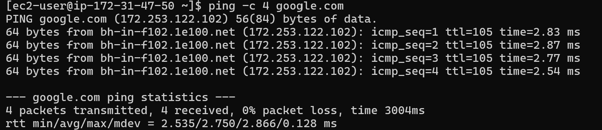
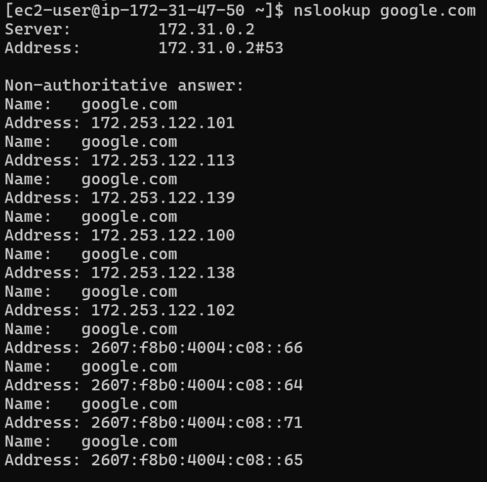
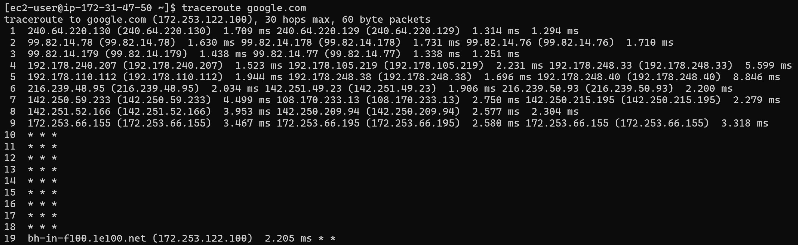
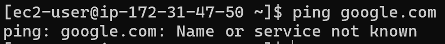
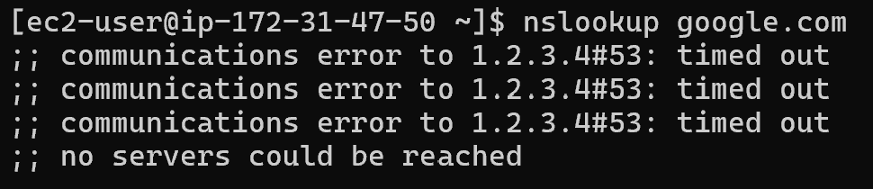
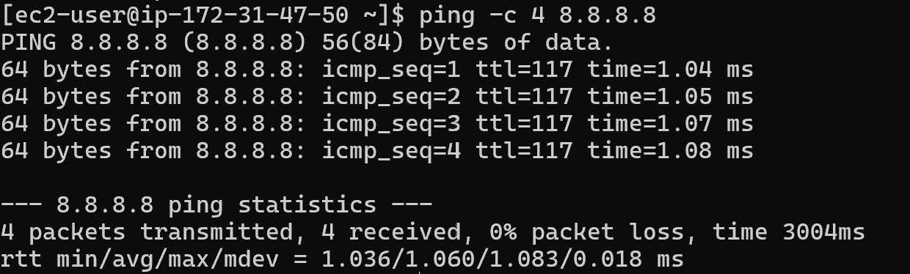
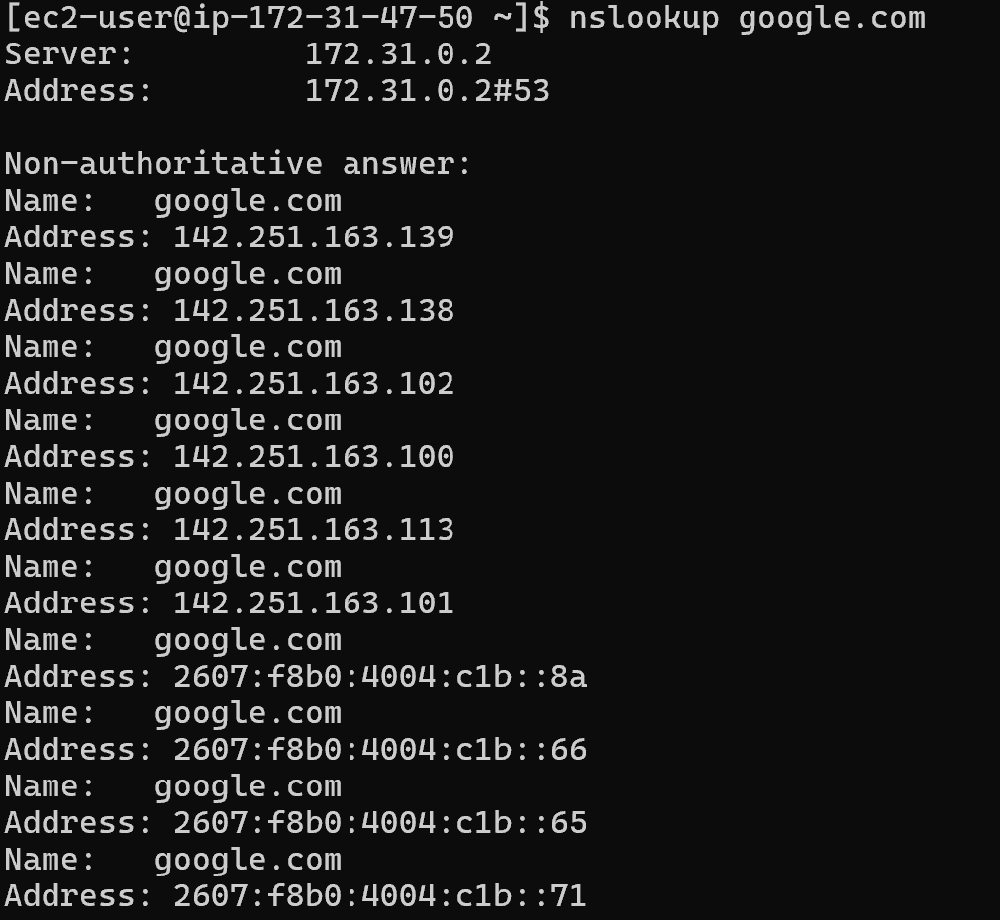
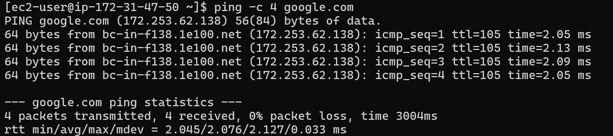

# 🌐 Network Troubleshooting Lab (Packet-Level)
A hands-on lab demonstrating real-world network troubleshooting by diagnosing and resolving DNS failures in an AWS environment.

## 🧭 Overview
This lab demonstrates packet-level network troubleshooting by simulating and resolving a DNS failure on an AWS EC2 instance.

The objective was to analyze network connectivity using tools such as ping, nslookup, and traceroute, identify the root cause of the issue, and restore proper DNS resolution.

This project highlights practical troubleshooting techniques used in real-world network engineering and cloud environments.

## 🧰 Tools Used
- AWS EC2 (Amazon Linux 2023)
- Linux Networking Tools
  - ping
  - nslookup
  - traceroute
  - tcpdump
- VPC Networking (AWS-managed DNS)

## ✅ Baseline Connectivity (Working State)
Initial tests confirmed that the system had full network connectivity and proper DNS resolution.

- Successfully pinged external domain (google.com)
- DNS queries resolved correctly using nslookup
- Traceroute showed multiple network hops to the destination

### Screenshots

- Ping Test (Working)

- DNS Resolution (Working)

- Traceroute Output (Working)

## ❌ DNS Failure Scenario

A DNS failure was intentionally introduced by modifying the system resolver configuration file (`/etc/resolv.conf`) and replacing the default nameserver with an invalid IP address (1.2.3.4).

This caused all domain-based network requests to fail due to the inability to resolve hostnames.

### Observed Behavior

- ping google.com failed with DNS resolution error

- nslookup google.com returned no results

- System unable to resolve domain names

## 🔍 Troubleshooting Steps

To isolate the issue, multiple tests were performed:

1. Tested domain connectivity:
   - `ping google.com` failed, indicating possible DNS issue

2. Tested direct IP connectivity:
   - `ping 8.8.8.8` succeeded, confirming network connectivity was functional

3. Tested DNS resolution:
   - `nslookup google.com` failed, confirming DNS resolution issue

4. Reviewed resolver configuration:
   - Identified incorrect nameserver entry in `/etc/resolv.conf`

These steps confirmed that the issue was isolated to DNS and not a broader network failure.

## 🛠️ Resolution

The issue was resolved by restoring the correct DNS resolver configuration.

- Updated `/etc/resolv.conf` to use the default AWS DNS server:
  - `nameserver 172.31.0.2`

- After correction:
  - DNS resolution was restored

  - Domain-based connectivity (ping google.com) succeeded

Additionally, it was observed that AWS automatically restores DNS settings via DHCP, reinforcing the importance of understanding cloud-managed networking behavior.

## 💡 Key Takeaways

- DNS failures can disrupt connectivity even when underlying network access is functional
- Verifying IP connectivity helps isolate DNS-related issues quickly
- Tools such as ping, nslookup, and traceroute are essential for network troubleshooting
- Reviewing system configuration files like `/etc/resolv.conf` is critical when diagnosing resolution issues
- Cloud environments such as AWS may automatically manage and restore network configurations via DHCP
